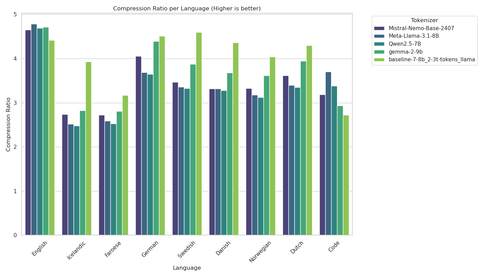
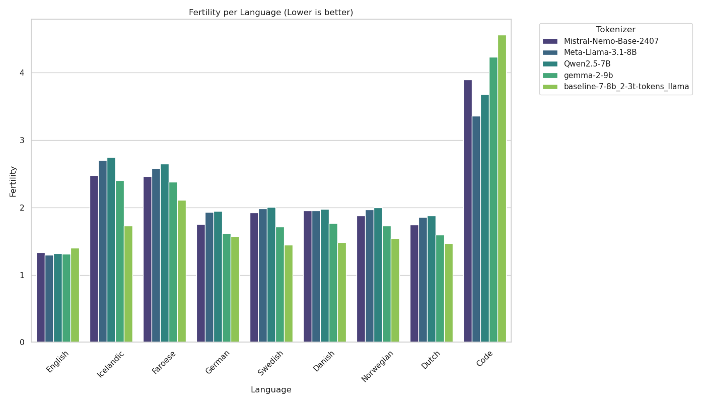
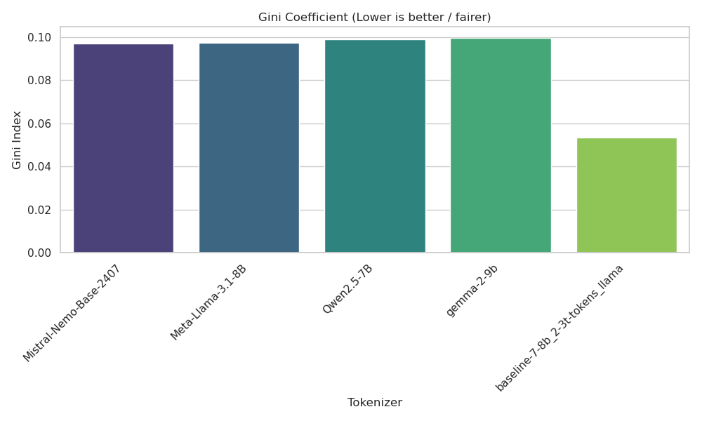
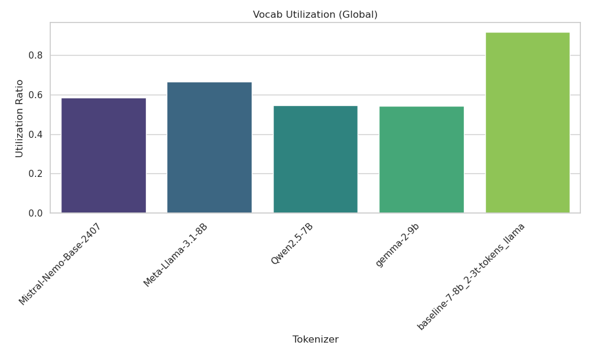
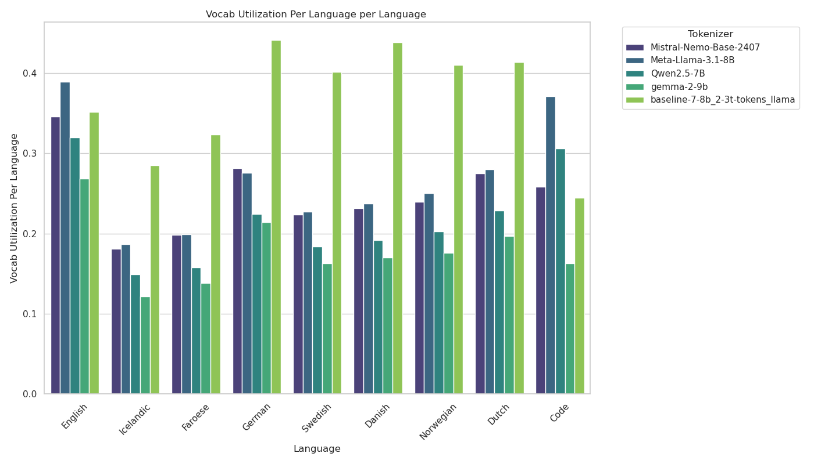
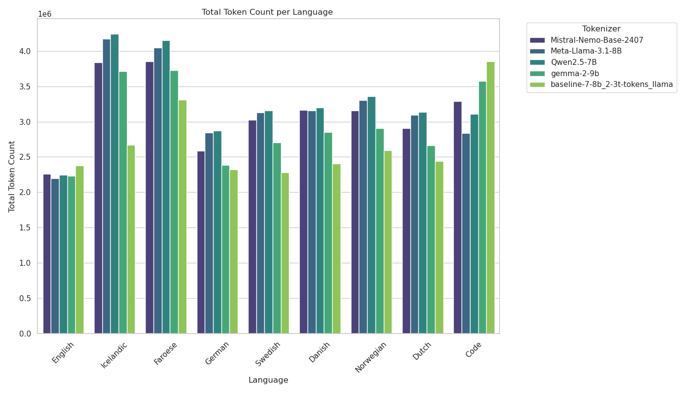

# Tokenizer Evaluation Report

This report presents a comprehensive evaluation of multiple tokenizers across various metrics that assess their efficiency, fairness, and vocabulary utilization. I collected 10MB of data for each langauge, across our current  curated dataset on JUDAC. This includes examples from fineweb-edu, fineweb2, HPLT, and the last minute collected data for faroese. For calculation of the gini coefficient, I used FLORES+ development set, as done by Apertus. The evaluated tokenizers include:

- Mistral-Nemo-Base-2407
- Meta-Llama-3.1-8B
- Qwen2.5-7B
- gemma-2-9b
- baseline-7-8b_2-3t-tokens_llama (TrustLLMeu custom tokenizer)

---

## 1. Compression Ratio

### Metric Definition

**Formula:** Compression Ratio = Total Bytes / Total Tokens

The compression ratio measures how efficiently a tokenizer can compress text. It is calculated by dividing the total number of UTF-8 bytes in the input text by the total number of tokens produced by the tokenizer (excluding special tokens).

### Interpretation

- **Higher values are better**: A higher compression ratio indicates that each token represents more bytes of text, meaning the tokenizer is more efficient at encoding information.
- **Typical range**: Values typically range from ~2 to ~5, depending on the language and tokenizer design.

### What It Shows

This metric reveals:

- **Tokenization efficiency**: How well a tokenizer compresses text into tokens
- **Language-specific performance**: Different languages may have varying compression ratios due to their linguistic characteristics
- **Cost implications**: Higher compression means fewer tokens are needed to represent the same text, reducing computational and storage costs

### Observations

- **English** shows the highest compression ratios across all tokenizers (~4.4-4.8), reflecting the bias toward English in most tokenizer training
- **Icelandic and Faroese** show notably lower compression ratios (~2.5-2.8 for most tokenizers), indicating these languages require more tokens per byte
- The **baseline TrustLLMeu tokenizer** performs particularly well on Nordic languages, showing more balanced compression across languages
- **Code** has moderate compression ratios (~2.7-3.7), with significant variation between tokenizers

---

## 2. Fertility

### Metric Definition

**Formula:** Fertility = Total Tokens / Total Words

Fertility measures the average number of subword tokens needed to represent a word. It is calculated by dividing the total number of tokens produced by the tokenizer by the total number of words (determined by simple whitespace splitting).

### Interpretation

- **Lower values are better**: Lower fertility means fewer tokens are needed per word, indicating more efficient word-level encoding.
- **Typical range**: Values typically range from ~1.3 to ~4.5, with lower values for well-supported languages.

### What It Shows

This metric indicates:

- **Subword granularity**: How finely a tokenizer breaks down words into subword units
- **Language support quality**: Well-supported languages will have lower fertility as common words are more likely to be in the vocabulary
- **Multilingual balance**: Comparing fertility across languages reveals biases in the tokenizer's training data

### Observations

- **English** consistently shows the lowest fertility (~1.3-1.4), confirming strong support across all tokenizers
- **Icelandic** exhibits the highest fertility for text languages (~2.4-2.7), indicating these complex morphological languages are challenging for most tokenizers
- **Code** has the highest overall fertility (~3.4-4.6), as programming languages have diverse syntax that fragments into many tokens
- The **baseline TrustLLMeu tokenizer** achieves notably lower fertility for Icelandic (~1.73) compared to other tokenizers, suggesting better Nordic language support

---

## 3. Gini Coefficient

### Metric Definition

**Formula:** Gini = (1/n) × (n + 1 - (2 × Σ[(n + 1 - i) × cᵢ] / Σcᵢ))

The Gini coefficient measures inequality in tokenization costs across different languages. It is calculated on parallel data (same content in different languages) using the inverse of compression ratios as tokenization costs. A Gini coefficient of 0 represents perfect equality, while 1 represents maximum inequality.

### Interpretation

- **Lower values are better/fairer**: A lower Gini coefficient indicates more equitable treatment of different languages.
- **Typical range**: Values typically range from ~0.05 to ~0.15 for modern multilingual tokenizers.

### What It Shows

This metric reveals:

- **Multilingual fairness**: How equally a tokenizer treats different languages
- **Language bias**: Higher values indicate some languages require disproportionately more tokens than others
- **Cross-lingual applicability**: Fairer tokenizers are better suited for multilingual applications

### Observations

- The **baseline TrustLLMeu tokenizer** achieves the lowest Gini coefficient (~0.053), indicating the most equitable treatment across languages
- **Other tokenizers** (Mistral, Meta-Llama, Qwen, Gemma) show similar Gini coefficients (~0.097-0.100), nearly twice as high as the baseline
- This significant difference suggests the custom tokenizer was specifically designed with multilingual fairness in mind

---

## 4. Vocabulary Utilization (Global)

### Metric Definition

**Formula:** Vocab Utilization = Unique Tokens Used / Total Vocabulary Size

Global vocabulary utilization measures the percentage of the tokenizer's vocabulary that is actually used when encoding a diverse multilingual corpus. It is calculated by dividing the number of unique token IDs observed across all test data by the total vocabulary size.

### Interpretation

- **Higher values are better**: Higher utilization indicates a more efficient vocabulary where most tokens serve a purpose.
- **Typical range**: Values typically range from ~0.5 to ~0.95, depending on vocabulary size and training data diversity.

### What It Shows

This metric indicates:

- **Vocabulary efficiency**: Whether the vocabulary contains many unused or rarely-used tokens
- **Training data diversity**: Well-utilized vocabularies reflect diverse training data
- **Vocabulary size appropriateness**: Very low utilization may suggest an oversized vocabulary

### Observations

- The **baseline TrustLLMeu tokenizer** shows exceptional vocabulary utilization (~91.8%), meaning nearly all tokens in its vocabulary are actively used
- **Meta-Llama-3.1-8B** has the second-highest utilization (~66.4%)
- **Mistral-Nemo-Base-2407** shows ~58.5% utilization
- **Qwen2.5-7B** and **gemma-2-9b** have the lowest utilization (~54.3-54.6%)
- The high utilization of the baseline tokenizer suggests it has a well-tuned vocabulary size for its target languages

---

## 5. Vocabulary Utilization Per Language

### Metric Definition

**Formula:** Vocab Utilization (Language L) = Unique Tokens Used in L / Total Vocabulary Size

This metric is similar to global vocabulary utilization but calculated separately for each language. It shows what percentage of the total vocabulary is needed to encode text in a specific language.

### Interpretation

- **Context-dependent**: Values are interpreted relative to other languages and tokenizers.
- **Higher values indicate**: The language activates a larger portion of the vocabulary.
- **Lower values may indicate**: The language is more uniformly encoded or the vocabulary is oversized.

### What It Shows

This metric reveals:

- **Language-specific vocabulary distribution**: Which languages utilize more distinct tokens
- **Vocabulary overlap**: Languages with similar utilization may share many tokens
- **Language representation quality**: Very low utilization might indicate poor support for that language

### Observations

- **English** shows relatively high per-language utilization (~27-39%) across tokenizers, as it activates many tokens
- **German** and **Code** show moderate to high utilization, particularly for the baseline tokenizer
- **Nordic languages** (Icelandic, Faroese, Swedish, Danish, Norwegian) show lower per-language utilization (~15-25%) for most tokenizers
- The **baseline TrustLLMeu tokenizer** shows notably higher utilization for German (~44.1%), Danish (~43.8%), and Norwegian (~41.0%), suggesting better representation of these languages
- **Icelandic** consistently shows the lowest per-language utilization (~12-28%), indicating it may be the most challenging language in the test set

---

## 6. Total Token Count Per Language

### Metric Definition

**Formula:** Total Token Count = Σ length(tokenize(textᵢ))

The total token count measures the sum of all tokens produced when encoding the test corpus for each language (excluding special tokens). This provides an absolute measure of how many tokens are required to represent a fixed amount of text.

### Interpretation

- **Lower values are generally better**: Fewer tokens mean more efficient encoding and lower computational costs.
- **Context matters**: Token counts should be considered relative to the amount of input text.

### What It Shows

This metric indicates:

- **Absolute tokenization efficiency**: The raw number of tokens needed for each language
- **Language-specific costs**: How much more expensive some languages are to process
- **Practical implications**: Direct impact on model training/inference costs, memory usage, and processing time

### Observations

- **Icelandic** and **Faroese** consistently require the most tokens (~3.7-4.3 million), reflecting their morphological complexity and poor support in most tokenizers
- **Code** shows high variability between tokenizers, with the baseline requiring notably more tokens (~3.8M) compared to Meta-Llama (~2.8M)
- **English** requires relatively fewer tokens (~2.2-2.3 million) across all tokenizers
- **German** shows interesting patterns with the baseline tokenizer requiring fewer tokens (~2.3M) compared to others (~2.8-2.9M)
- The **baseline TrustLLMeu tokenizer** shows more balanced token counts across Nordic languages, though still higher than English, indicating improved but not perfect multilingual support

---

## Summary

The evaluation reveals significant differences in tokenizer performance across languages and metrics:

1. **English dominance**: All tokenizers show best performance (highest compression, lowest fertility) on English, confirming the well-known bias in modern LLM tokenizers.
2. **Nordic language challenges**: Icelandic and Faroese consistently show the poorest performance metrics across all tokenizers, requiring more tokens and exhibiting lower compression ratios.
3. **TrustLLMeu baseline tokenizer strengths**: The custom baseline tokenizer demonstrates:

   - Superior multilingual fairness (lowest Gini coefficient)
   - Exceptional vocabulary utilization (~92%)
   - Better Nordic language support (especially Icelandic)
   - More balanced performance across languages
4. **Code tokenization**: Programming language tokenization shows high variability between tokenizers, with fertility ranging from 2.7 to 4.6, suggesting room for specialized code tokenizers.
5. **Trade-offs**: Different tokenizers optimize for different goals—some prioritize overall efficiency (compression), while others (like the baseline) prioritize fairness and multilingual balance.

These metrics provide valuable insights for selecting appropriate tokenizers based on specific use cases, language requirements, and fairness considerations.
